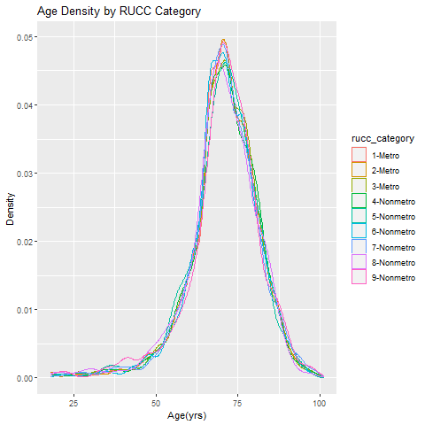
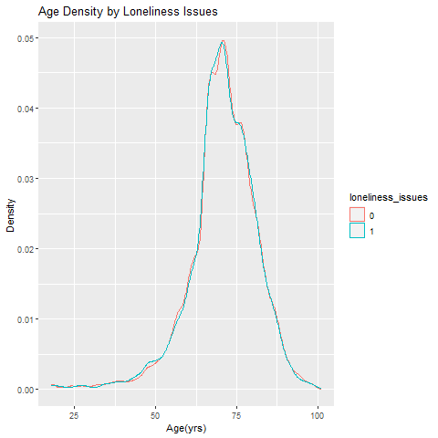
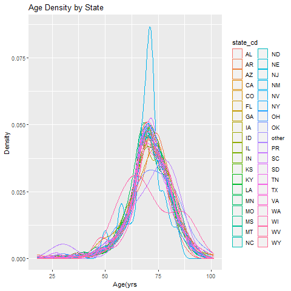

```{r, setup, include=FALSE}
knitr::opts_chunk$set(
  echo = FALSE, warning = FALSE, message=FALSE,error=FALSE, fig.width = 6, fig.height = 6
)
```

This is the rmarkdown code for Patrick Zhang's semester project in INFO 550.  The primary goal is to determine how medicare beneficiaries that are at risk for having loneliness issues differ from those that don't.  At this point, the investigators would like a summary table to compare similarities between groups.

```{r}
### IMPORTANT: Set directory for data on github
git_dat <- "https://raw.githubusercontent.com/pzhan56/B550_Semproj/master/raw_data/INFO550_Semproj_dat.csv"
git_dict <- "https://raw.githubusercontent.com/pzhan56/B550_Semproj/master/raw_data/Data_Dictionary.csv"
git_medicare <- "https://raw.githubusercontent.com/pzhan56/B550_Semproj/master/raw_data/Medicare_segmentation_values.csv"

### Packages
library(dplyr)
library(tidyselect)
library(tidyverse)
library(ggplot2)
library(stringr)
library(furniture)
library(knitr)
library(readr)

# ------------------- Import Data ----------------------- #
# Raw data
dat <-read_csv(git_dat) %>%
  mutate(loneliness_issues = as.factor(loneliness_issues))
# Variable definitions
var_def <- read_csv(git_dict)
# Medicare Segmentation values
Medicare_def <- read_csv(git_medicare)

```

```{r}
# Count number of rows (denominator) and subset important groups into separate dataframes
n_allrows <- nrow(dat)
dat_tpyes <- dat[dat$loneliness_issues==1,]
dat_tpno <- dat[dat$loneliness_issues==0,]
n_tpyes <- nrow(dat_tpyes)
n_tpno <- nrow(dat_tpno)

### Test proportions of variables
# Sex
sex.eqtest <- prop.test(x = c(nrow(dat[(dat$sex_cd=="M" & dat$loneliness_issues==1),]),
                       nrow(dat[(dat$sex_cd!="M" & dat$loneliness_issues==1),])),
                      n = c(nrow(dat[dat$sex_cd=="M",]), nrow(dat[dat$sex_cd!="M",])))
```

Below is a summary table of demographics within this datset

```{r}
### Make a table with several variables, test if they are equal
Pred_vars <- str_c(names(dat), collapse = ", ")

demo_table1_raw <- table1(dat,
                      est_age, sex_cd, lang_spoken_cd, mabh_seg, rucc_category, state_cd
                      ,splitby = ~loneliness_issues
                      ,row_wise = T,
                      na.rm=F,
                      test = TRUE,
                      type="full")

demo_table1 <- as.data.frame(demo_table1_raw)
demo_table2 <- demo_table1 %>%
  rename(Characteristic = ".", "No Loneliness Issues" = "0" ,"Loneliness Issues" = "1" )

kable(demo_table2)

```

Distribution of age between key variables seemed be somewhat constant except for state.  Below are density histograms of age by some key varaiables.

```{r, figure-2}

#
#
```


Additional devtools information is below.

```{r}
devtools::session_info()
```
